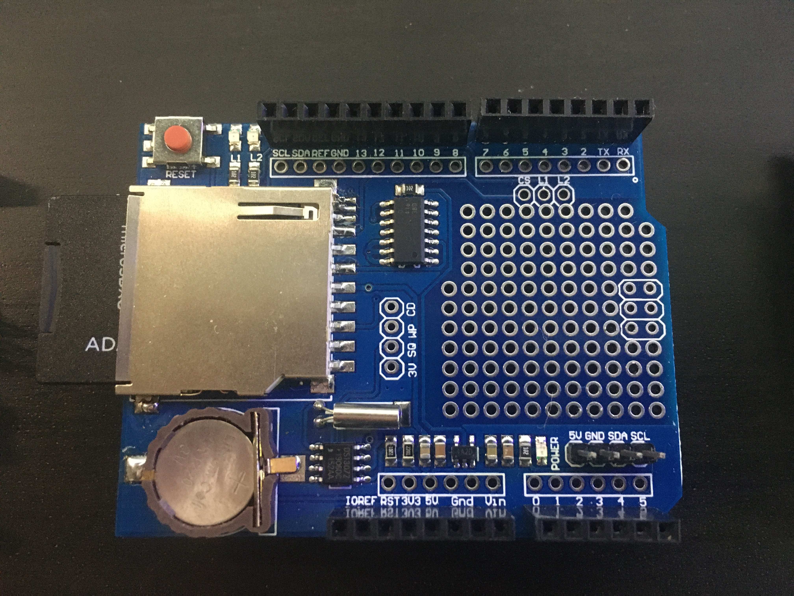
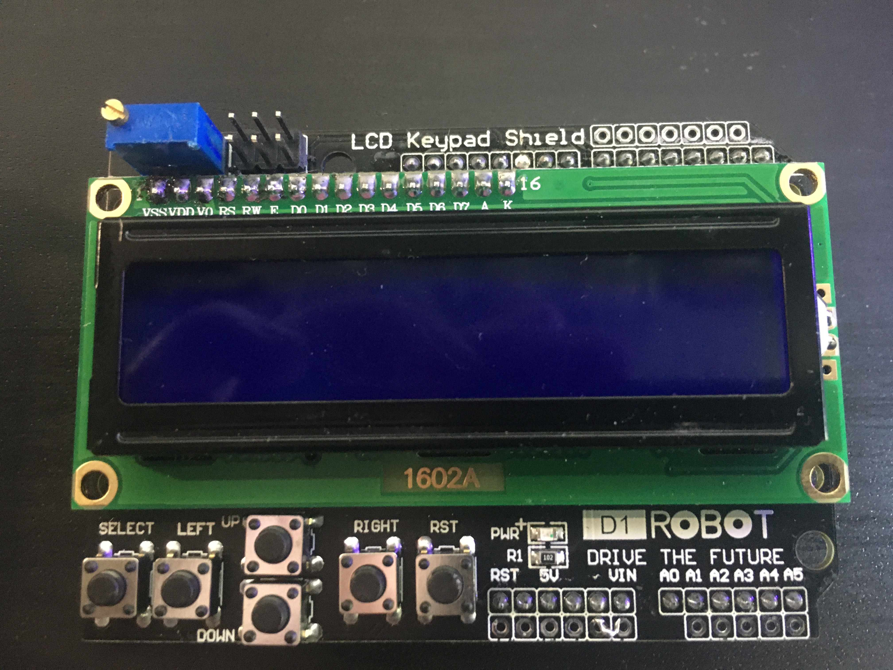

I modded the original Firwmware so you can make your own (cheap) Interrupter using an  Arduino UNO or Duemilanove plus two Shields.
Here the parts you will need (see folder pictures and manuals for more information): 

   

 * Arduino UNO or Duemilanove: https://store.arduino.cc/arduino-uno-rev3 or cheap remake https://www.az-delivery.de/products/uno-r3-board-mit-atmega328p-und-usb-kabel
 * Datalogger Shield: https://learn.adafruit.com/adafruit-data-logger-shield or cheap remake https://www.az-delivery.de/products/datenlogger-modul?_pos=1&_sid=d2708e960&_ss=r
 * LCD-Keypad Shield: https://wiki.dfrobot.com/LCD_KeyPad_Shield_For_Arduino_SKU__DFR0009 or cheap remake https://www.az-delivery.de/products/azdelivery-hd44780-1602-lcd-module-display-2x16-zeichen-fur-arduino-lcd1602-keypad
 * Quality: you get what you pay for and READ THE FUCKING MANUAL :D
 * Attention: LCD Shield (at least the ones i used) you need to trimm Pin 10, usually used for Backlight control but is needed for the SD card (PIN 10 for Chip selelect). Backlight is now always on, but usually you need this anyway   
  * To use it at all you need to enable Debug mode go to constants.h and uncomment the line 11 //#define DEBUG (original firmare would need some minor tweaks, but nothing serious)
 * Attention: in Debug mode the original oneTesla-SD-Interrupter wont work!!!
 * some other parts:
 * 1x LED FIB OPT 660NM SUPERBRITE RED IF-E97 https://www.digikey.de/product-detail/de/industrial-fiber-optics/IF-E97/FB129-ND/272338
 * 1x CONN JACK STEREO 3.5MM R/A https://www.digikey.de/product-detail/de/switchcraft-inc/35RAPC4BH3/SC1464-ND/1288781
 * 1x 4N24 Optokoppler https://www.digikey.de/product-detail/de/vishay-semiconductor-opto-division/4N25/4N25VS-ND/1738516
 * 1x CONN IC DIP SOCKET 6POS https://www.digikey.de/product-detail/de/te-connectivity-amp-connectors/1-2199298-1/A120346-ND/5022037
 * 1x 1N4148
 * 1x 100Ohm 1/4W
 * 1x 100kOhm 1/4W
 * 1x 220Ohm 1/4W
 * 1x 3.3kOhm 1/4W
 * 1x TRS-MIDI Type A Adapter (check thats connected according to specs, DIN 4 = Ring, DIN 5 = Tip otherwise it wont work!!!):  https://www.thomann.de/de/teenage_engineering_midi_cable_kit.htm 
 * in total its something between 40$ and 60$ and maybe 1hr work (less if you already know what your are doing)
 * to use it you need to power it with a Battery pack or Notebook when not connected to mains, e.g. when using Live Mode

still work in progress but code works and Fixed Mode too
waiting for a few parts to finish up the Live Mode

   

---------------------------------------------------------------------------------------------------------------
Original description below
---------------------------------------------------------------------------------------------------------------

This is the source and binary distribution for the oneTeslaTS SD card interrupter. Most users do not need to download this file - this package is useful only if you are modifying or reflashing your ATMega firmware.

==Description==

The SD card interrupter is designed to be a full-featured interrupter with support for live MIDI streaming and playback of local files stored on an SD card. Great care was taken to ensure that all source remained Arduino-compatible, and that the entire firmware would run on a single ATMega328 microcontroller. It features:

*Streaming from MIDI devices, including computers and keyboards.
*Playback of MIDI-like files ("OMD") from a micro SD card.
*Fixed mode with precise timer-based frequency control down to 1Hz.
*Small firmware size using fixed-point math, no softfloat libraries or FPU needed.

==Building==

This firmware has been developed on Arduino 1.0.3. We do not recommend using other versions due to Arduino's occasional tendency to break backwards compatibility. You will need to copy the libraries in inc/ to arduino-1.0.3/libraries. After that, it should be as simple as opening src/main/main.ino and clicking "Verify/Compile" in the Arduino IDE.

==File description==

src/main
    |------ constants.h: assorted user-adjustable compile-time settings
    |------ data.h: include file for global variables
    |------ datatypes.h: program data structures
    |------ lcd.h, lcd.cpp: abstraction layer for the display; currently just a wrapper around Arduino's libraries.
    |------ main.ino: the main program loops
    |------ player.h, player.cpp: MIDI event handlers
    |------ sdsource.h, sdsource.cpp: SD card MIDI source
    |------ serialsource.h, serialsource.cpp: Hardware MIDI source
    |------ system.h, system.cpp: nonportable ATMega-specific routines
    |------ timers.h, timers.cpp: nonportable ATMega-specific ISR's
    |------ util.h, util.cpp: various utility functions

inc/
    |------ LiquidCrystal: Hitachi LCD driver library
    |------ PFFS: Petit FatFS filesystem driver

bin/
    |------ SDinterrupter.hex: pre-compiled binary for your convenience

omd/
    |------ omdconvert/
    |            |------ omdconvert.exe: MIDI to OMD converter
    |            |------ omdconvert.cpp: Source for the converter
    |            |------ README.txt: README for the converter
    |
    |------ *.mid, *.OMD: sample files

README.txt: this file :)

==LICENSING==

The libraries in inc/ are licensed under their authors' respective licensing. You are free to modify and redistribute the source and binaries found in this package for NONCOMMERCIAL USE as long as credit is given and this notice is included. Please note that in doing so, you give oneTesla, LLC nonexclusive, royalty-free license to use any such modifications for any purpose.

(We're normally not a fan of no-commercial-use source licenses as it hinders the usefulness of the code, but here we believe it is reasonable since it prevents others from unfairly mooching off our hard work while still leaving the source available for the community to use. For commerical use please contact us for further licensing terms, and we can probably work something out.)

==LEGAL DISCLAIMER==

Disclaimer of Warranty.
THERE IS NO WARRANTY FOR THE PROGRAM, TO THE EXTENT PERMITTED BY APPLICABLE LAW. EXCEPT WHEN OTHERWISE STATED IN WRITING THE COPYRIGHT HOLDERS AND/OR OTHER PARTIES PROVIDE THE PROGRAM “AS IS” WITHOUT WARRANTY OF ANY KIND, EITHER EXPRESSED OR IMPLIED, INCLUDING, BUT NOT LIMITED TO, THE IMPLIED WARRANTIES OF MERCHANTABILITY AND FITNESS FOR A PARTICULAR PURPOSE. THE ENTIRE RISK AS TO THE QUALITY AND PERFORMANCE OF THE PROGRAM IS WITH YOU. SHOULD THE PROGRAM PROVE DEFECTIVE, YOU ASSUME THE COST OF ALL NECESSARY SERVICING, REPAIR OR CORRECTION.

Limitation of Liability.
IN NO EVENT UNLESS REQUIRED BY APPLICABLE LAW OR AGREED TO IN WRITING WILL ANY COPYRIGHT HOLDER, OR ANY OTHER PARTY WHO MODIFIES AND/OR CONVEYS THE PROGRAM AS PERMITTED ABOVE, BE LIABLE TO YOU FOR DAMAGES, INCLUDING ANY GENERAL, SPECIAL, INCIDENTAL OR CONSEQUENTIAL DAMAGES ARISING OUT OF THE USE OR INABILITY TO USE THE PROGRAM (INCLUDING BUT NOT LIMITED TO LOSS OF DATA OR DATA BEING RENDERED INACCURATE OR LOSSES SUSTAINED BY YOU OR THIRD PARTIES OR A FAILURE OF THE PROGRAM TO OPERATE WITH ANY OTHER PROGRAMS), EVEN IF SUCH HOLDER OR OTHER PARTY HAS BEEN ADVISED OF THE POSSIBILITY OF SUCH DAMAGES.

If the disclaimer of warranty and limitation of liability provided above cannot be given local legal effect according to their terms, reviewing courts shall apply local law that most closely approximates an absolute waiver of all civil liability in connection with the Program, unless a warranty or assumption of liability accompanies a copy of the Program in return for a fee.

